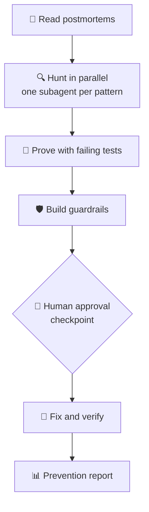

# Never Twice

> **Every team writes postmortems. Nobody uses them. Never Twice turns every past incident into automatic protection against the next one.**

Demo video: [DEMO VIDEO LINK]  
Team: Aluvala Sai Shailu Sri, G Rusheek

---

## Challenge Fit

Never Twice was built for the **IBM Bob 2.0 hackathon**. It directly improves the debugging and application maintenance workflow by automating the gap between "we wrote the postmortem" and "we checked for the same bug everywhere."

**Bob 2.0 features used:**

- **Custom Bob mode** (`.bob/custom_modes.yaml`) — a purpose-built `never-twice` mode that encodes the full workflow
- **Agent mode** — drives all code-reading, test-writing, and fix steps
- **Parallel subagents** — one subagent per bug pattern, all hunting at the same time
- **Document understanding** — reads postmortem files to extract structured bug patterns
- **Human-in-the-loop approval** — mandatory checkpoint before any code is changed

---

## Results

| | Manual review | Never Twice |
|---|---|---|
| **Time** | 26 minutes | ~6 min automated work |
| **Total time incl. human review** | 26 minutes | ~11 minutes |
| **Bugs found** | 1 of 7 | 7 of 7 |
| **Bugs missed** | 6 | 0 |
| **False alarms on decoy code** | 0 | 0 |
| **Reports pointing to already-fixed code** | 4 of 5 | 0 |
| **Tests written** | 0 | 13 (all failing before, all passing after) |
| **Fixes applied** | 0 | 7 |
| **Guardrail: issues before fixes** | — | 7 |
| **Guardrail: issues after fixes** | — | 0 |
| **Messages typed by user** | — | 2 |

> **Manual baseline:** one teammate, no AI tools, same postmortems and code, who had briefly seen the code in an earlier attempt. Small-sample test, shown for illustration.

Results were verified against an answer key kept outside the repository and outside Bob's context.

---

## The Problem

When a production incident happens, teams write a postmortem. The postmortem captures what went wrong and how it was fixed. What almost never happens next is a systematic audit of the rest of the codebase for the same bug pattern.

This project's three sample postmortems illustrate the cost:

- **PM-001** — a missing `None` check in one endpoint caused 1,247 failed requests and 12 customer complaints over 4 hours. The same pattern existed in three other places that were never checked.
- **PM-002** — an HTTP call with no timeout caused a 23-minute SEV-1 outage with an estimated £6,200 revenue at risk. The same pattern was in two more functions.
- **PM-003** — a naive/aware datetime mix-up caused silent wrong results on some environments and TypeError crashes on others, going undetected for weeks. Two more functions had the same flaw.

These repeat bugs could have been found the day each postmortem was written, if anyone had searched for the pattern.

---

## How It Works



1. **Learn from postmortems** — Bob reads every file in `postmortems/` and extracts a generalised bug pattern for each incident, saved to `reports/patterns.md`.
2. **Hunt in parallel** — one subagent per pattern fans out across the codebase simultaneously; results are merged into `reports/findings.md` with a binary verdict (confirmed bug or safe) for every function examined.
3. **Prove with failing tests** — for each confirmed bug Bob writes a pytest test that fails on the unfixed code, confirming the bug is real and testable.
4. **Build guardrails** — an AST-based static analyser (`guardrails/check_patterns.py`) is created that flags the exact patterns, plus a PR review checklist.
5. **Human approval checkpoint** — Bob stops and presents the full findings table; no code is touched until the user types "approve".
6. **Fix and verify** — fixes are applied, all 13 tests are rerun (must all pass), and the guardrail is rerun (must exit 0).
7. **Prevention report** — `reports/PREVENTION_REPORT.md` records every metric, every safe location examined, and the projected impact of each bug if it had shipped.

---

## IBM Bob 2.0 Features — Exactly Where

| Feature | Where it is used |
|---|---|
| **Custom Bob mode** | `.bob/custom_modes.yaml` — defines the `never-twice` slug, the six-step workflow, and the guardrail validation rules |
| **Agent mode** | All code reading, test writing, fix application, and report generation run in Agent mode |
| **Parallel subagents** | Step 2: three `spawn_subagent` calls run concurrently, one per bug pattern, each searching all Python files independently |
| **Document understanding** | Step 1: Bob reads `.md` postmortem files and extracts structured patterns — no manual copy-paste |
| **Human-in-the-loop approval** | Step 5: a mandatory checkpoint between "finding bugs" and "changing code"; the user reviews the findings table and types "approve" before any file is modified |

---

## Self-Validating Guardrails

The Never Twice mode enforces a strict rule: before the approval checkpoint, the guardrail must be run on the unfixed code and must flag **exactly** the confirmed bugs — same count, no extras flagged against safe or already-fixed locations, no manual filtering.

This rule was added after catching a guardrail with **57 false positives** during development. That guardrail flagged 64 issues on the original code; only 7 were real. It had to be replaced entirely. The mode now instructs Bob to check every guardrail with this exact-match test and fix it before continuing.

See the [Guardrail Correction](reports/PREVENTION_REPORT.md#guardrail-correction) section in `reports/PREVENTION_REPORT.md` for the full account.

---

## Quick Start

### Requirements

- Python 3.9+
- Git
- IBM Bob

No API keys or credentials are needed for this project.

### Setup

**Windows (PowerShell)**

```powershell
python -m venv .venv
.venv\Scripts\Activate.ps1
pip install -r app/requirements.txt
```

> **If activation fails** with "running scripts is disabled on this system", run this once, then try again:
> ```powershell
> Set-ExecutionPolicy -Scope CurrentUser RemoteSigned
> ```

**Mac / Linux**

```bash
python3 -m venv .venv
source .venv/bin/activate
pip install -r app/requirements.txt
```

### Run the tests

```bash
python -m pytest tests -v
```

### Run the guardrail

```bash
python guardrails/check_patterns.py app
```

Exits with code 0 (clean) or code 1 (issues found).

### Run the Never Twice mode

1. Open this folder in IBM Bob.
2. Select **Never Twice** in the mode picker.
3. Type: `Run the full workflow.`
4. Answer the two folder questions (source folder and postmortems folder).
5. Review the approval table when Bob pauses at the checkpoint.
6. Type: `approve`

---

## Reproduce the Demo from the Original Buggy Code

To replay the full workflow from scratch on the unfixed codebase (Windows PowerShell):

```powershell
git checkout -b replay-demo buggy-baseline
git checkout main -- .bob .github docs
Remove-Item -Recurse -Force tests, .pytest_cache, app\__pycache__ -ErrorAction SilentlyContinue
```

Then follow the **Run the Never Twice mode** steps above. In our runs, Bob found all 7 bugs, wrote the tests, built the guardrail, waited for approval, applied the fixes, and produced the prevention report.

---

## Use It on Your Own Project

1. Add your postmortems to a `postmortems/` folder using the template in [`docs/POSTMORTEM_TEMPLATE.md`](docs/POSTMORTEM_TEMPLATE.md).
2. Open your project in IBM Bob and select the **Never Twice** mode.
3. Follow the workflow — source folder, postmortems folder, approval checkpoint.

Full instructions, including how to adapt the guardrail and CI workflow for your paths, are in [`docs/HOW_TO_USE.md`](docs/HOW_TO_USE.md).

---

## CI Guardrail

[`.github/workflows/never-twice.yml`](.github/workflows/never-twice.yml) runs on every push and every pull request across all branches. It:

- Tests on **Python 3.9 and 3.12** in parallel (matrix strategy).
- Runs `pytest tests/ -v --tb=short` — fails the workflow on any test failure.
- Runs `python guardrails/check_patterns.py app/` — fails the workflow if any pattern is found (exit code 1).

Any pull request that reintroduces a known bug pattern fails this check.

---

## Bob Session Reports

`bob_sessions/` contains the exported Bob task history for the entire project.

**`bob-tasks-never-twice-2026-09-26.md`** records each Bob session used to build this project:

| Session | What it built |
|---|---|
| Sample app and postmortems | The hotel-booking Flask app and the three incident postmortems (PM-001, PM-002, PM-003) |
| First run and reusable mode | The initial full workflow run and the first version of the custom mode definition |
| Custom-mode demo run | End-to-end execution of the packaged Never Twice mode on the buggy baseline |
| Guardrail validation rules | Addition of the exact-match validation rules to the mode after the 57-false-positive incident |
| `.gitignore` setup | Credential and artefact exclusions |
| Report correction | Update of `reports/PREVENTION_REPORT.md` with the validated guardrail's numbers and the Guardrail Correction section |
| README | This README |

---

## Project Structure

```
.bob/              Custom mode definition (never-twice)
.github/           CI workflow (never-twice.yml)
app/               Sample Flask hotel-booking application
bob_sessions/      Exported Bob task history for the whole project
docs/              HOW_TO_USE.md, POSTMORTEM_TEMPLATE.md
guardrails/        AST-based pattern checker + PR review checklist
postmortems/       Three incident postmortems (PM-001, PM-002, PM-003)
reports/           findings.md, patterns.md, PREVENTION_REPORT.md
tests/             13 pytest tests covering the 7 confirmed bugs
.bobignore         Prevents Bob from logging credential patterns
.env.example       Environment variable template (no credentials needed here)
SECURITY.MD        IBM hackathon security guidance
```

---

## Security

This project follows the IBM hackathon security template. **No credentials are used** — the app runs entirely on in-memory fixtures and requires no API keys.

**Security layers in this repo:**

| Layer | What it does |
|---|---|
| `.gitignore` | Prevents `.env` files, private keys, and session files from being committed |
| `.bobignore` | Prevents Bob from logging credential patterns (API keys, passwords, secrets, tokens) in session history |
| `.env.example` | Template showing which environment variables would be needed; safe to commit because it contains no real values |

**Before every commit — checklist:**

- [ ] Reviewed `git diff` for sensitive data
- [ ] No hardcoded API keys or passwords in any file
- [ ] `.env` is not staged
- [ ] No files with "credential" or "secret" in the name
- [ ] Any credentials are loaded from environment variables, not hardcoded

See [`SECURITY.MD`](SECURITY.MD) for the full IBM hackathon security guidance.

---

## Future Improvements

- **Real-world postmortems and larger codebases** — test and tune the pattern-extraction and search steps on production incident histories and multi-thousand-file repositories.
- **More language support** — extend beyond Python to JavaScript/TypeScript, Java, and Go, where the same classes of bugs (missing null checks, unguarded HTTP calls, timezone errors) are equally common.
- **Pull-request comments linked to postmortems** — when the guardrail flags a reintroduced pattern in a PR, post a comment that links directly to the postmortem that first recorded it, giving the reviewer full context.
- **Incident and prevention dashboard** — a summary view of all postmortems ingested, patterns extracted, bugs found and fixed, and guardrail hits over time.
